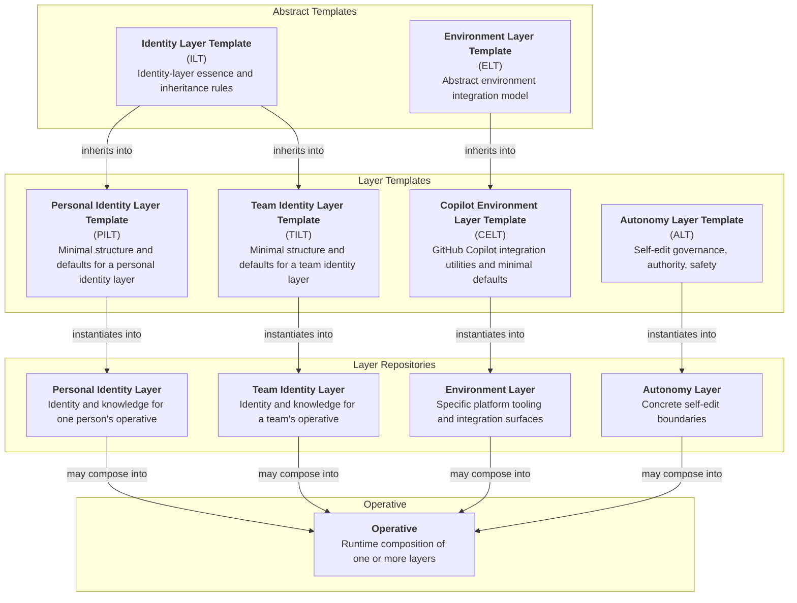

# AI Operative System Architecture

This document captures the intended final ecosystem architecture, boundaries, repo relationships, and canonical terminology for the AI Operative system.

## System Structure

The ecosystem organizes around these layers of structure:

1. Abstract Templates
   - `ILT`: What is the essence of an Identity Layer?
   - `ELT`: What must be considered when integrating an Operative into a particular platform?

2. Layer Templates
   - `ALT`: What governance must be considered when allowing an Operative to modify itself?
   - `PILT` / `TILT`: What minimum defaults define a Personal / Team Identity Layer?
   - `CELT`: What does an Operative need to integrate seamlessly into GitHub Copilot?

3. Layer Repositories
   - Personal Identity Layer: Who is this specific personal identity layer and what does it always know?
   - Team Identity Layer: Who is this specific team identity layer and what does it always know?
   - Environment Layer: What platform-specific tooling does this individual or team provide for their Operatives?
   - Autonomy Layer: What boundaries does this individual or team impose around self-editing?

4. Operatives
   - Runtime compositions of layer repositories within a specific platform context and the embodied instance of that composition in a host platform.

Layers define Operatives; layers are not themselves Operatives. When multiple layers are loaded together, the resulting Operative internalizes the composite guidance as a single identity rather than as a stack of personas.

## Repository Relationships

- `ILT` is the shared systems upstream for `PILT` and `TILT`.
- `ELT` remains abstract, with `CELT` as its first concrete environment-template line.
- `ALT` is a directly usable layer template rather than an abstract template family.
- Abstract templates may inherit into directly usable layer templates where such template families are useful.
- Templates instantiate into concrete layer repositories.
- Operatives are runtime compositions of one or more layer repositories, and no layer type is universally required.

## Content Model

- Content is classified by its durable home first, then by any generated or runtime projection of that content.
- Cross-platform canon, platform-specific canon, generated artifacts, and local working state are distinct surfaces with different ownership and lifecycles.
- Durable reference context belongs in canonical repositories and documents.
- Ephemeral execution state belongs in local working control surfaces.
- Generated artifacts are reviewable projections of canon and are not hand-edited as primary sources.

## Copilot Environment Integration

Environment integration is modeled at the `ELT` level, with `CELT` as the first concrete environment-template line. `CELT` defines the shape of an operative's GitHub Copilot integration surface. A CELT-derived integration instantiates as the operative's `.github/` directory itself, with `copilot-instructions.md` generated there as the primary top-level instruction file. Within that surface, canon-derived generated artifacts and Copilot-specific canonical artifacts remain distinct.

## Template Tree

## Architectural Principles

- The repository is the master. Live instances are disposable projections of repo-owned truth.
- Operative layers are portable, repo-sovereign, instance-symmetric identity modules.
- Core identity files should be authored as complete identities that can dovetail cleanly with other layers when combined.
- System-level integration logic belongs in shared system layers; platform-specific embodiment belongs in environment layers.
- Copilot integration is environment-layer work, not identity-layer or autonomy-layer canon.
- Persistent behavior belongs in git, even when it is platform-specific.
- Generated artifacts are projections of canon, not silent replacements for canon.