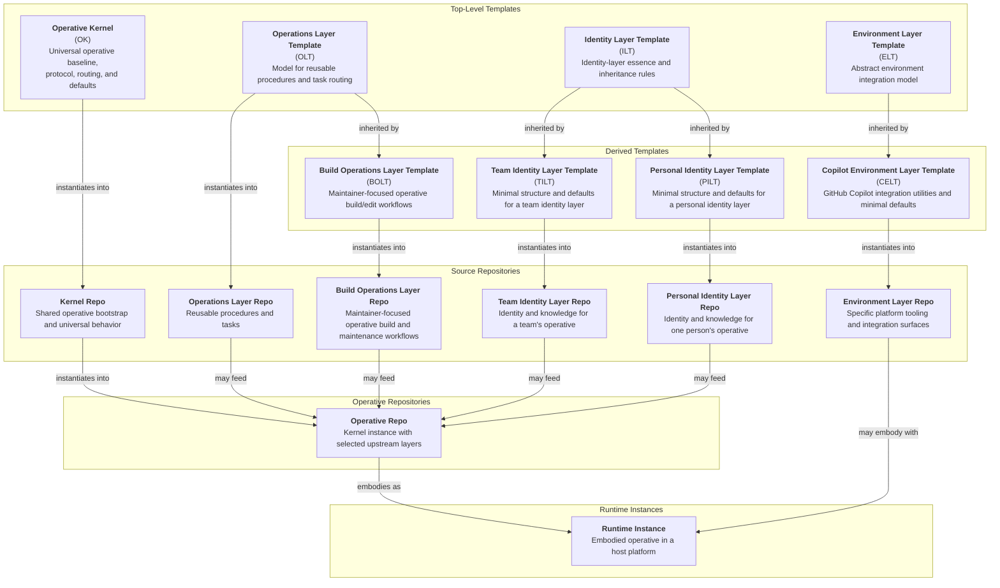

# AI Operative System Architecture

An Operative is a durable AI system defined by its operative files. It begins from the kernel, composes selected layers into a coherent operative identity, and may then be embodied across one or more host environments. An Operative may expose multiple modes or personas without becoming multiple operatives. This document describes that architecture at the system level: what the core entities are, how they relate, and how an Operative is assembled, embodied, updated, and maintained.

## System Hierarchy

The ecosystem is organized around three primary categories: Templates, Layers, and Operatives.

- Templates define reusable structural patterns.
- Layers are concrete canonical sources instantiated from templates.
- Operatives are durable systems instantiated from the kernel and composed from selected layers.

Within that hierarchy, the kernel is the template for an Operative. Other top-level templates define layer families. Templates instantiate into Layers, except for the kernel, which instantiates into Operatives. Layers then compose into Operatives. Runtime instances are embodiments of an Operative in a host system, not a separate primary architecture category.

### System Diagram

## Template Families

### Operative Kernel

The kernel is the universal template for an Operative. Every Operative begins as an instance of the kernel and inherits the operative-level contract defined by `PROTOCOL` together with the adjacent routing, governance, assembly, task, and update surfaces that make that contract usable.

The kernel defines the minimum shared structure of an Operative. A valid Operative may remain entirely read-only with respect to canonical operative files and still remain a complete Operative.

At the source level, the kernel provides the required operative file family: the protected `PROTOCOL` surface together with the adjacent routing, governance, assembly, task, and update surfaces that make an Operative coherent and maintainable as a durable system.

`PROTOCOL` is the hard floor of the operative contract. It is intended to be preserved verbatim rather than edited by layer or Operative maintainers. The rest of the kernel file family routes, interprets, and assembles that contract, but does not override it.

### Identity Layer Family

`ILT` defines the shared shape of identity layers. Identity layers supply enduring identity, mission, persona, and judgment canon that can be composed into an Operative without losing provenance.

`PILT` and `TILT` are direct descendants of `ILT`. They specialize that shared identity-layer shape for personal and team identity sources while remaining identity layers in the same family.

### Operations Layer Family

`OLT` defines the shared shape of operations layers. Operations layers provide reusable procedures and task-routing canon that an Operative can invoke without treating those procedures as part of its identity.

`BOLT` is an `OLT`-derived line for maintainer-focused workflows. It carries the procedures and governance that allow an Operative to build, maintain, and edit operative canon under explicit authority.

### Environment Layer Family

`ELT` defines the shared shape of environment layers. Environment layers do not redefine the Operative. They define how a platform-agnostic Operative is embodied in a specific host system.

`CELT` is the first concrete environment-template line. It defines a GitHub Copilot-native environment layer authored directly in GitHub's required layout, such as a `.github/` directory, so that the environment layer can combine with an Operative as a Copilot embodiment rather than as an ordinary constituent repo inside the Operative.

## Operative Lifecycle

### Instantiation And Composition

An Operative begins as an instance of the kernel. It is then composed from selected identity and operations layers, each of which remains a canonical upstream source rather than being flattened into anonymous local canon.

An Operative is defined by its operative files: the files surfaced through its operative-level `INDEX`. Files not surfaced there may still matter as sources, submodule contents, or implementation details, but they are not part of the operative surface.

When directive conflicts arise between operative files and non-operative files, operative files win.

The default deployed unit is an Operative repo, not a loose workspace of sibling layer repositories. Included source-bearing layer repositories remain distinct repos inside the Operative through pinned submodules. `ASSEMBLY` is the canonical declarative record of which sources are included, how they relate, and how the resulting Operative should be built.

An Operative may include multiple operations layers when needed, provided their routing preserves provenance explicitly through namespaces or equivalent mechanisms.

### Assembly And Artifacts

`assemble-operative` is the canonical workflow for instantiating and refreshing an Operative repo from the kernel, selected upstream layers, and `ASSEMBLY` canon. It does not redefine the Operative. It materializes the implementation surfaces required to instantiate the operative contract already defined by the kernel and the selected sources.

This yields a durable distinction between source canon, generated artifacts, and local working state.

- Source canon lives in the kernel repo, layer repos, and Operative repo surfaces that act as maintained sources of truth.
- Generated artifacts are reviewable projections of canon and are not hand-edited as primary sources.
- Local working state belongs in workspace control surfaces and other ephemeral execution context.

### Embodiment

An Operative repo is platform-agnostic. Environment layers combine with that Operative at embodiment time to produce runtime instances in specific host systems.

Because environment layers are authored in host-native layouts, they are not treated as ordinary constituent repos inside the Operative's internal structure. They remain canonical upstream embodiment surfaces that combine with the Operative to form a host-specific runtime such as a GitHub Copilot installation.

### Governed Editing And Maintenance

Operative files are immutable canon by default. The kernel defines the universal baseline and assembly plumbing for an Operative, but it does not by itself grant general authority to edit operative canon.

Governed editing exists only when a loaded layer explicitly authorizes it and supplies the requisite governance. `BOLT` is the maintainer-focused operations-layer line for that capability. A `BOLT`-enabled Operative may carry `EDITING_<Repo>.md` files in the Operative root, with each file governing edits to its corresponding authorized target repo or layer.

In multi-target workflows, those governance files apply per target. Each authorized repo or layer is governed by its own `EDITING_<Repo>.md` without bleeding rules across other targets.

When an Operative has edit access to a constituent layer, it edits that layer in its canonical repo and pushes or proposes the change upstream there. If a maintainer wants durable divergence from an upstream layer or template, that divergence becomes a forked canonical source rather than an unofficial Operative-local variant.

### Update Handling

Operatives include layers as canonical upstream sources, so upstream and downstream evolution remains explicit. Upstream changes are reviewed through `curate-updates` rather than consumed through blind pulls or mandatory synchronization.

The canonical downstream disposition states are `Included`, `Excluded`, and `Deferred`. Repositories that expect selective downstream consumption should publish `09_CHANGELOG_*` as an update ledger designed for that workflow, with enough context for a maintainer to decide whether and how to advance downstream canon.

Downstream tracking should mirror relevant upstream history closely enough for the maintainer and Operative to see what has been included, excluded, and deferred.

Companion artifacts may support review and adoption, but canon remains authoritative over any convenience package.