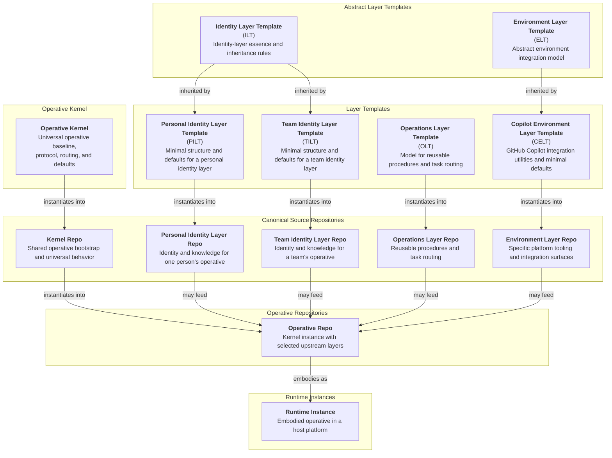

# AI Operative System Architecture

This document captures the intended final ecosystem architecture, boundaries, repo relationships, and canonical terminology for the AI Operative system.

## System Structure

The ecosystem organizes around these layers of structure:

1. Operative Kernel
   - `Kernel`: the universal operative baseline and starting state for every Operative. At its center is `PROTOCOL`, which defines what an Operative is. The rest of the required kernel file family routes, governs, assembles, and maintains that operative definition.

2. Abstract Layer Templates
   - `ILT`: What is the essence of an Identity Layer?
   - `ELT`: What must be considered when integrating an Operative into a particular platform?

3. Layer Templates
   - `OLT`: What scaffolding and sane defaults make reusable procedures reliably available to an Operative?
   - `PILT` / `TILT`: What minimum defaults define a Personal / Team Identity Layer?
   - `CELT`: What does an Operative need to integrate seamlessly into GitHub Copilot?

4. Canonical Source Repositories
   - Kernel Repo: the shared upstream source for operative-level bootstrap and universal behavior.
   - Personal Identity Layer Repo: who is this specific personal identity source and what does it always know?
   - Team Identity Layer Repo: who is this specific team identity source and what does it always know?
   - Operations Layer Repo: what can this Operative do, and how are those procedures routed?
   - Environment Layer Repo: what platform-specific tooling does this individual or team provide for their Operatives?

5. Operative Repositories
   - Durable assembled Operatives that inherit the kernel baseline, implement the operative contract defined by `PROTOCOL`, and incorporate selected upstream layer repositories.

6. Runtime Instances
   - Platform-specific embodiments of an Operative repo in a host runtime.

Layers are not themselves Operatives. An Operative begins as an instance of the kernel, is defined by its operative files, and incorporates selected layer canon into a single coherent operative. It may expose multiple modes or personas without becoming multiple operatives.

## Repository Relationships

- The kernel is a required upstream for every Operative repo.
- `ILT` is the shared systems upstream for `PILT` and `TILT`.
- `OLT` is a directly usable layer template for reusable procedural task files.
- `ELT` remains abstract, with `CELT` as its first concrete environment-template line.
- Abstract templates may inherit into directly usable layer templates where such template families are useful.
- Templates instantiate into concrete layer repositories.
- Operative repos begin as instances of the kernel and add one or more selected layer repositories.
- `PROTOCOL` defines the operative contract itself. The rest of the required kernel file family implements, routes, governs, assembles, and maintains that contract.
- An Operative is defined by its operative files: the files surfaced at the operative level through its `INDEX`.
- Files not surfaced there may still matter as sources, submodule contents, or implementation details, but they are not part of the operative surface.
- Included source-bearing layer repositories are mounted inside an Operative repo as pinned submodules.
- Layer repositories remain the canonical upstream authoring and update surfaces; users deploy Operative repos rather than loose layer combinations.
- Identity layer repositories may be included in an Operative as baseline identity, blended identity, or persona-only sources according to the Operative's `ASSEMBLY` canon.
- Multiple operations layer repositories may be included in one Operative, with explicit namespaces or other provenance-preserving routing when needed.
- Included layer repositories remain source-bearing inside the Operative repo rather than being flattened into a homogeneous canon surface.
- When directive conflicts arise between operative files and non-operative files, operative files win.
- Target-specific edit governance belongs to the Operative repo rather than to the normal runtime layer surface.

## Content Model

- Content is classified by its durable home first, then by any generated or runtime projection of that content.
- Cross-platform canon, platform-specific canon, generated artifacts, and local working state are distinct surfaces with different ownership and lifecycles.
- Durable reference context belongs in canonical repositories and documents.
- `PROTOCOL` is the canonical definition of an Operative. Other kernel files are implementation surfaces around that definition.
- Layer repositories are canonical upstream authoring surfaces, not the default deployment unit.
- Operative repositories are durable downstream compositions that selectively ingest kernel and layer canon while preserving included source provenance.
- Operative repositories also carry maintainer-facing governance surfaces for the targets they are configured to edit.
- Ephemeral execution state belongs in local working control surfaces.
- Generated artifacts are reviewable projections of canon and are not hand-edited as primary sources.
- `OLT` is the canonical home for modular procedural task files that are not inseparable from operative identity.
- `ILT` may retain a `TASKS` file only when its procedures are inseparable from identity, judgment, or canon stewardship.

## Operative Assembly Model

- The default deployed unit is an Operative repo, not a loose workspace of sibling layer repositories.
- `assemble-operative` is the canonical workflow for bootstrapping and refreshing an Operative repo from the kernel, selected upstream layers, and `ASSEMBLY` canon.
- `assemble-operative` does not redefine the Operative. It materializes the implementation surfaces required to instantiate the operative contract defined by `PROTOCOL`.
- Bootstrapping an Operative first instantiates the kernel, then mounts one or more upstream layer repositories as pinned submodules together with precedence rules and a target environment.
- `04_ASSEMBLY.md` is the canonical home for upstream sources, pinned submodule states, precedence, edit enablement, generated outputs, and the rest of the constituent-layer assembly rules.
- Identity sources may be included as baseline identity, blended identity, or persona-only inputs.
- Multiple operations sources may be included in one Operative, with explicit namespaces or equivalent provenance-preserving routing where needed.
- Included source repos remain preserved inside the Operative repo as source-bearing submodules.
- Build workflows compile kernel and selected layer routing surfaces into operative-level runtime artifacts while preserving included source files as the maintenance surface.
- Operative-level maintenance works from the currently pinned submodule states; maintenance workflows for editable included repos remain scoped to those upstream repos rather than to the Operative as a whole.

## Edit Governance Model

- Kernel `PROTOCOL` provides the protected operative protocol that defines the operative contract and governs operative assembly, traversal, routing, and precedence interpretation.
- Adjacent kernel governance files provide the default edit-policy baseline for an Operative when no more specific governance source speaks.
- Whether an Operative is configured to edit a given included repo is declared in the Operative's `ASSEMBLY` canon.
- Each editable target repo may have a corresponding `EDITING_<Repo>.md` governance artifact in the Operative repo.
- `EDITING_<Repo>.md` governs how the Operative edits that target repo and is authoritative where it speaks.
- Kernel edit-policy defaults apply when the target repo's `EDITING_<Repo>.md` is absent or silent.
- The kernel `PROTOCOL` file remains the hard floor for edit-system protocol and other non-overrideable invariants.
- `EDITING_<Repo>.md` files are maintainer-facing governance artifacts for edit workflows. They are not part of the normal assembled runtime prompt surface unless an edit workflow explicitly loads them.
- Multi-repo edit workflows apply each target repo's `EDITING_<Repo>.md` to that repo's writes while the Operative coordinates sequencing, reconciliation, and regeneration across the whole workflow.

## Update Model

- Operatives include layers as canonical upstream sources. They do not officially own divergent local copies of those layers.
- When an Operative has edit access to a constituent layer, it edits that layer in its canonical repo and pushes or proposes the change upstream there.
- If a maintainer wants durable divergence from an upstream layer or template, that divergence becomes a forked canonical source rather than an unofficial Operative-local variant.
- The same maintenance pattern applies across the ecosystem: `OK -> Operative`, template -> layer, and any other upstream-downstream canon relationship that expects selective downstream adoption.
- Upstream changes are not consumed through blind pulls or mandatory synchronization. They are reviewed through the canonical `curate-updates` workflow.
- `curate-updates` is the kernel-owned baseline task for selectively advancing downstream canon through upstream changes without clobbering downstream decisions.
- The workflow reviews upstream changelog entries and any companion artifacts with the maintainer, then records a disposition for each entry before applying approved changes.
- The canonical downstream disposition states are `Included`, `Excluded`, and `Deferred`.
   - `Included` means the downstream canon has taken in that upstream change, whether verbatim or tailored for local fit.
   - `Excluded` means the downstream maintainer has intentionally chosen not to include that upstream change.
   - `Deferred` means the downstream maintainer has not yet settled the decision.
- Repositories that expect selective downstream consumption should publish `09_CHANGELOG_*` as an update ledger designed for this workflow, not merely as a terse list of atomic commits.
- Each upstream changelog entry should provide enough context and rationale for a maintainer to decide whether and how to include it, and should identify the exact files or surfaces affected.
- Downstream changelog tracking should mirror the relevant upstream update history closely enough for the downstream maintainer and Operative to track what has been included, excluded, or deferred.
- Companion release artifacts such as bundles of changed files may support this workflow, but canon remains authoritative over any convenience package.

## Copilot Environment Integration

Environment integration is modeled at the `ELT` level, with `CELT` as the first concrete environment-template line. `CELT` defines the shape of an Operative repo's GitHub Copilot integration surface. A CELT-derived integration instantiates as the Operative's `.github/` directory itself, with `copilot-instructions.md` generated there as the primary top-level instruction file. Within that surface, canon-derived generated artifacts and Copilot-specific canonical artifacts remain distinct.

## Template Tree

## Architectural Principles

- The repository is the master. Live instances are disposable projections of repo-owned truth.
- The default deployment unit is an assembled Operative repo rather than a loose workspace of raw layer repositories.
- Kernel and layer repositories are upstream canon; Operative repos are governed downstream compositions of that canon with preserved source trees rather than flattened canon.
- Included source-bearing layer repos remain distinct Git repos inside the Operative through pinned submodules.
- Core identity files should be authored as durable upstream identity sources that can be assembled into one operative without collapsing provenance.
- Reusable procedures belong in operations layers unless they are inseparable from operative identity itself.
- Capability and tool requirements are descriptive, not permission tiers. When a required capability or tool is unavailable, the Operative asks, falls back, or defers rather than fabricating compliance.
- System-level integration logic belongs in shared system layers; platform-specific embodiment belongs in environment layers.
- Copilot integration is environment-layer work, not identity-layer canon.
- Edit governance is target-local: kernel policy provides defaults, and target-repo `EDITING_<Repo>.md` files override those defaults for edits to that target.
- Internal task names should optimize first for maintainability and compositional clarity inside canon. Personality, metaphor, platform commands, and other user-facing ergonomics belong in layer-level or environment-level overlays rather than in the shared core naming baseline.
- Persistent behavior belongs in git, even when it is platform-specific.
- Generated artifacts are projections of canon, not silent replacements for canon.

## Required Kernel File Family

Every assembled Operative must include the required kernel file family. The kernel is the canonical upstream source for that operative-level surface; included layers feed it but do not become independently operative by default.

Here, `protected` means the file is part of the Operative's internal plumbing and is not intended to be customized. Editing it changes the designed operative baseline; once changed, the result should be treated as an unofficial fork rather than as the unmodified Operative.

`PROTOCOL` is the ecosystem-defining file in this family. The remaining required kernel files are implementation surfaces around it: they route it, apply defaults around it, assemble sources around it, expose baseline workflows around it, and maintain update history around it.

- `00_PROTOCOL_*`: the kernel must provide the operative-level `PROTOCOL` file as the sole protected operative surface. It must remain intact and must not be repurposed in a way that breaks operative assembly, traversal, routing, or precedence interpretation.
- `01_INDEX_*`: the kernel must provide the operative-level `INDEX` routing surface. Its table structure must remain a truthful routing surface that reflects real files. When a referenced file is excluded from an assembled Operative, remove the corresponding `INDEX` row rather than repurposing it.
- `02_TASKS_*`: the kernel must provide the operative-level baseline task surface, including kernel-local procedures required for assembly and maintenance.
- `03_GOVERNANCE_*`: the kernel must provide the operative-level default governance surface for behavior that should not be omitted, inferred ad hoc, or left to chance.
- `04_ASSEMBLY_*`: the kernel must provide the operative-level assembly surface for included sources, precedence, edit enablement, and generated outputs.
- `09_CHANGELOG_*`: the kernel must provide the operative-level update ledger for selective downstream update curation.
- Reserved filename slots `00-19`: these numeric slots remain reserved in kernel and assembled operative surfaces. Maintainers must not repurpose a defined kernel file family slot for a different file family.