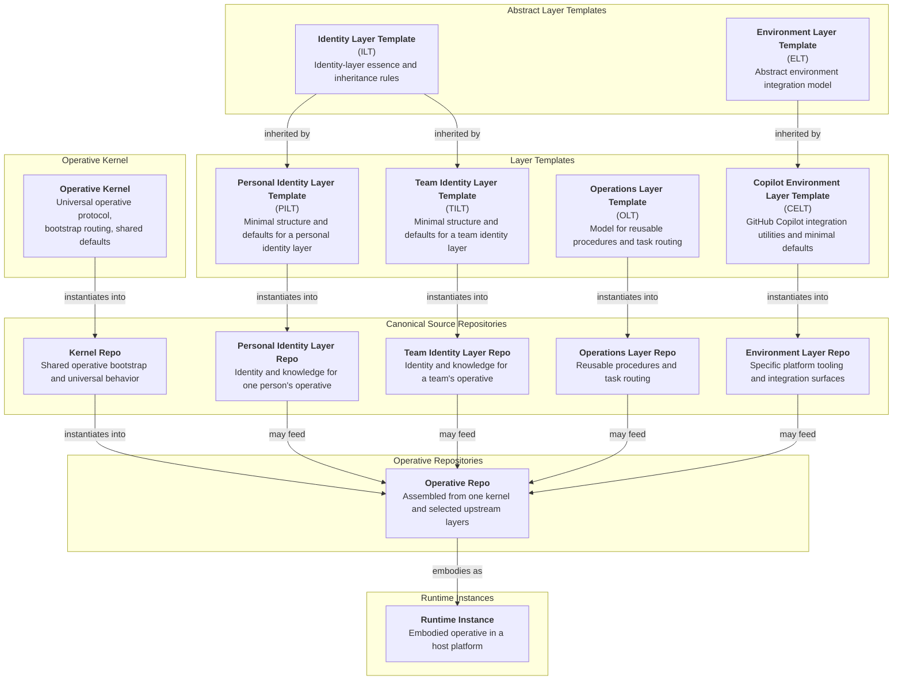

# AI Operative System Architecture

This document captures the intended final ecosystem architecture, boundaries, repo relationships, and canonical terminology for the AI Operative system.

## System Structure

The ecosystem organizes around these layers of structure:

1. Operative Kernel
   - `Kernel`: the universal operative baseline and starting state for every Operative. It provides the operative-level `CORE` contract, bootstrap routing surface, and shared execution defaults required by every assembled Operative.

2. Abstract Layer Templates
   - `ILT`: What is the essence of an Identity Layer?
   - `ELT`: What must be considered when integrating an Operative into a particular platform?

3. Layer Templates
   - `OLT`: What scaffolding and sane defaults make reusable procedures reliably available to an Operative?
   - `PILT` / `TILT`: What minimum defaults define a Personal / Team Identity Layer?
   - `CELT`: What does an Operative need to integrate seamlessly into GitHub Copilot?

4. Canonical Source Repositories
   - Kernel Repo: the shared upstream source for operative-level bootstrap and universal behavior.
   - Personal Identity Layer Repo: who is this specific personal identity source and what does it always know?
   - Team Identity Layer Repo: who is this specific team identity source and what does it always know?
   - Operations Layer Repo: what can this Operative do, and how are those procedures routed?
   - Environment Layer Repo: what platform-specific tooling does this individual or team provide for their Operatives?

5. Operative Repositories
   - Durable assembled Operatives built from one kernel plus one or more selected upstream layer repositories, plus the Operative-local governance and build surfaces needed to maintain and project that composition.

6. Runtime Instances
   - Platform-specific embodiments of an Operative repo in a host runtime.

Layers are not themselves Operatives. An Operative repo internalizes its selected upstream kernel and layer canon as one coherent operative that may expose multiple modes or personas without ceasing to be one operative.

## Repository Relationships

- The kernel is a required upstream for every Operative repo.
- `ILT` is the shared systems upstream for `PILT` and `TILT`.
- `OLT` is a directly usable layer template for reusable procedural task files.
- `ELT` remains abstract, with `CELT` as its first concrete environment-template line.
- Abstract templates may inherit into directly usable layer templates where such template families are useful.
- Templates instantiate into concrete layer repositories.
- Operative repos are built from one kernel and one or more selected layer repositories.
- Included source-bearing layer repositories are mounted inside an Operative repo as pinned submodules.
- Layer repositories remain the canonical upstream authoring and update surfaces; users deploy Operative repos rather than loose layer combinations.
- Identity layer repositories may be included in an Operative as baseline identity, blended identity, or persona-only sources according to the Operative manifest.
- Multiple operations layer repositories may be included in one Operative, with explicit namespaces or other provenance-preserving routing when needed.
- Included layer repositories remain source-bearing inside the Operative repo rather than being flattened into a homogeneous canon surface.
- Target-specific edit governance belongs to the Operative repo rather than to the normal runtime layer surface.

## Content Model

- Content is classified by its durable home first, then by any generated or runtime projection of that content.
- Cross-platform canon, platform-specific canon, generated artifacts, and local working state are distinct surfaces with different ownership and lifecycles.
- Durable reference context belongs in canonical repositories and documents.
- Layer repositories are canonical upstream authoring surfaces, not the default deployment unit.
- Operative repositories are durable downstream compositions that selectively ingest kernel and layer canon while preserving included source provenance.
- Operative repositories also carry maintainer-facing governance surfaces for the targets they are configured to edit.
- Ephemeral execution state belongs in local working control surfaces.
- Generated artifacts are reviewable projections of canon and are not hand-edited as primary sources.
- `OLT` is the canonical home for modular procedural task files that are not inseparable from operative identity.
- `ILT` may retain a `TASKS` file only when its procedures are inseparable from identity, judgment, or canon stewardship.

## Operative Assembly Model

- The default deployed unit is an Operative repo, not a loose workspace of sibling layer repositories.
- `assemble-operative` is the canonical workflow for bootstrapping and refreshing an Operative repo from its kernel, selected upstream layers, and Operative manifest.
- Bootstrapping an Operative first instantiates the kernel as the initial operative baseline, then mounts one or more upstream layer repositories as pinned submodules together with precedence rules and a target environment.
- The Operative manifest records upstream sources, pinned submodule states, precedence, edit enablement, and generated outputs.
- Identity sources may be included as baseline identity, blended identity, or persona-only inputs.
- Multiple operations sources may be included in one Operative, with explicit namespaces or equivalent provenance-preserving routing where needed.
- Included source repos remain preserved inside the Operative repo as source-bearing submodules.
- Build workflows compile kernel and selected layer routing surfaces into operative-level runtime artifacts while preserving included source files as the maintenance surface.
- Operative-level maintenance works from the currently pinned submodule states; maintenance workflows for editable included repos remain scoped to those upstream repos rather than to the Operative as a whole.

## Edit Governance Model

- Kernel `CORE` provides the default edit-policy baseline for an Operative together with the protected do-not-touch protocol that governs how edit mode works.
- Whether an Operative is configured to edit a given included repo is declared in the Operative manifest.
- Each editable target repo may have a corresponding `EDITING_<Repo>.md` governance artifact in the Operative repo.
- `EDITING_<Repo>.md` governs how the Operative edits that target repo and is authoritative where it speaks.
- Kernel edit-policy defaults apply when the target repo's `EDITING_<Repo>.md` is absent or silent.
- The kernel `CORE` do-not-touch section remains the hard floor for edit-system protocol and other non-overrideable invariants.
- `EDITING_<Repo>.md` files are maintainer-facing governance artifacts for edit workflows. They are not part of the normal assembled runtime prompt surface unless an edit workflow explicitly loads them.
- Multi-repo edit workflows apply each target repo's `EDITING_<Repo>.md` to that repo's writes while the Operative coordinates sequencing, reconciliation, and regeneration across the whole workflow.

## Copilot Environment Integration

Environment integration is modeled at the `ELT` level, with `CELT` as the first concrete environment-template line. `CELT` defines the shape of an Operative repo's GitHub Copilot integration surface. A CELT-derived integration instantiates as the Operative's `.github/` directory itself, with `copilot-instructions.md` generated there as the primary top-level instruction file. Within that surface, canon-derived generated artifacts and Copilot-specific canonical artifacts remain distinct.

## Template Tree

## Architectural Principles

- The repository is the master. Live instances are disposable projections of repo-owned truth.
- The default deployment unit is an assembled Operative repo rather than a loose workspace of raw layer repositories.
- Kernel and layer repositories are upstream canon; Operative repos are governed downstream compositions of that canon with preserved source trees rather than flattened canon.
- Included source-bearing layer repos remain distinct Git repos inside the Operative through pinned submodules.
- Core identity files should be authored as durable upstream identity sources that can be assembled into one operative without collapsing provenance.
- Reusable procedures belong in operations layers unless they are inseparable from operative identity itself.
- Capability and tool requirements are descriptive, not permission tiers. When a required capability or tool is unavailable, the Operative asks, falls back, or defers rather than fabricating compliance.
- System-level integration logic belongs in shared system layers; platform-specific embodiment belongs in environment layers.
- Copilot integration is environment-layer work, not identity-layer canon.
- Edit governance is target-local: kernel policy provides defaults, and target-repo `EDITING_<Repo>.md` files override those defaults for edits to that target.
- Persistent behavior belongs in git, even when it is platform-specific.
- Generated artifacts are projections of canon, not silent replacements for canon.

## Protected structural surface

Every assembled Operative must preserve the anchors below. The kernel is the canonical upstream source for the operative-level `CORE` and `INDEX` contract; included layers feed that operative-level surface but do not become independently operative by default.

- `00_CORE_*`: the kernel must provide the operative-level `CORE` file. Its `Operative Layer Protocol` subsection (the section defining layering behavior, stack traversal, and `INDEX` routing semantics) must remain intact and must not be repurposed in a way that breaks operative assembly or traversal.
- `01_INDEX_*`: the kernel must provide the operative-level `INDEX` routing surface. Its table structure must remain a truthful routing surface that reflects real files. When a referenced file is excluded from an assembled Operative, remove the corresponding `INDEX` row rather than repurposing it; editing template-defined rows is strongly discouraged.
- Reserved filename slots `00-19`: these numeric slots remain protected in kernel and assembled operative surfaces. Maintainers may omit files in these slots but must not reuse a reserved slot number for a different file family.