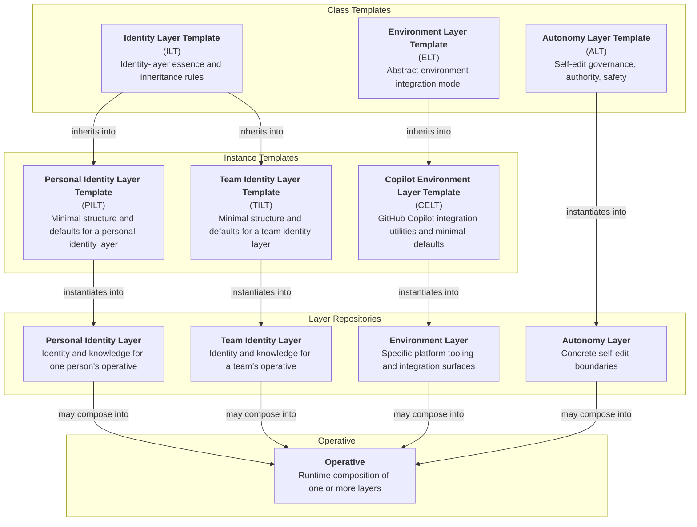

# AI Operative System Documentation

This repository is the documentation home for the AI Operative ecosystem. It defines the core architectural principles, shared concepts, and organizational structure that guide the design and development of all operative layers, templates, and instances.

## Current System Shape

The ecosystem currently organizes around these layers of structure:

1. Class Templates
   - `ILT`: What is the essence of an Identity Layer?
   - `ALT`: What governance must be considered when allowing an Operative to modify itself?
   - `ELT`: What must be considered when integrating an Operative into a particular platform?

2. Instance Templates
   - `PILT` / `TILT`: What minimum defaults define a Personal / Team Identity Layer?
   - `CELT`: What does an Operative need to integrate seamlessly into GitHub Copilot?

3. Layer Repositories
   - Personal Identity Layer: Who is this specific personal identity layer and what does it always know?
   - Team Identity Layer: Who is this specific team identity layer and what does it always know?
   - Environment Layer: What platform-specific tooling does this individual or team provide for their Operatives?
   - Autonomy Layer: What boundaries does this individual or team impose around self-editing?

4. Operatives
   - Runtime compositions of layer repositories within a specific platform context and the embodied instance of that composition in a host platform.

## Template Tree

`ALT` currently routes directly into concrete autonomy layers because no useful autonomy instance-template split has been identified yet. `ELT` remains abstract for now, with `CELT` as its first concrete environment-template line.

## Core Architectural Principles

- The repository is the master. Live instances are disposable projections of repo-owned truth.
- Operative layers are portable, repo-sovereign, instance-symmetric identity modules.
- Persistent behavior belongs in git, even when it is platform-specific.
- Generated artifacts are projections of canon, not silent replacements for canon.
